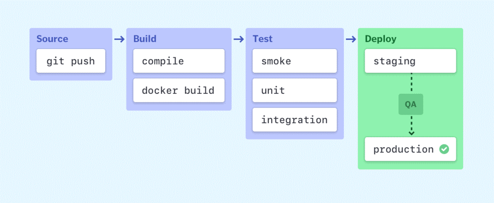

(Närvarande: Hampus, Andreas)

**Sätta upp pipeline i Azure**

**Teori**: 

## “Continuous Integration (CI) & Continuous Deployment (CD)”

[*https://www.youtube.com/watch?v=1er2cjUq1UI*](https://www.youtube.com/watch?v=1er2cjUq1UI)

[*https://explainagile.com/agile/xp-extreme-programming/practices/continuous-integration/*](https://explainagile.com/agile/xp-extreme-programming/practices/continuous-integration/)

[*https://semaphoreci.com/blog/cicd-pipeline*](https://semaphoreci.com/blog/cicd-pipeline)

[*https://www.goodfirms.co/glossary/software-deployment/*](https://www.goodfirms.co/glossary/software-deployment/)

*https://www.youtube.com/watch?v=LNLKZ4Rvk8w*

 

**Den generella tanken:**

Att alla utvecklar (som man beukar göra) comiitar kod i små paket och ofta för att undvika mergekonflikter.

Ovanpå detta sen så sätter man upp en automatisering som hela tiden bygger applikationen och testar den nya koden för att se om det fungerar tillfredställande. Detta ska ske efter varje commit. Om något inte fungerar som det ska så kommer ett mail eller annat meddelande som berättar var felet uppstod. Det blir ett sorts säkerhetsnät. 

 

Detta gör också att det alltid finns en build som kompilerar som går att testa. Det är också ett bra sätt att undvika det som kallas för ”merge-hell” och för att upptäcka buggar tidigt.

 

En viktig notering är att båda bergeppen CI och CD här nedanför redan görs i ett utvecklingsteam (allt som vanligast). Saken är den att det görs manuellt, detta handlar om hur man kan automatisera dessa steg.

 

**Vad är det?**

Ett sätt att utveckla mjukvara på som möjliggör för flera team att arbeta samtidigt men även att säkerställa att den kod som skrivs går att köra samt är så problemfri som möjligt. Det faller innanför ramarna för det som kallas DevOps.

 

**Vad är det bra för?**

Förutom det som är nämnt ovanstående så möjliggör det också för snabbare releaser, snabbare bugg-detektion, bättre koordinering av olika utvecklingsteam, höja kvaliteten på mjukvaran, öka produktiviteten genom att minska tidsåtgång till problem eller röror, minska risken för mänskliga misstag etc.

 

**Tar det inte mycket prestanda från maskinerna?**

Det kan såklart vara kostsamt prestandamässigt med automatiska tester och builder hela tiden, men det går att förlägga dessa uppgifter annorstädes, t.ex. på en virtuell maskin eller varför inte i en container? Ett mål är att en CI process inte ska ta mer än 10 minuter.

 

**CD, vad är det?**

CD eller *Continuous Delivery* är processen vilken igenom man levererar en färdig produkt till en slutanvändare och ska endast ske efter att man noggrant testat produkten för att se till att det inte finns några buggar, kompileringsfel eller andra problem*.*

 

Även om slutmålet med det som kallas ”deployment” inom mjukvaruutvecklingsvärlden är att mjukvaran ska bli redo för konsumenten så betyder inte ordet ”deployment” nödvändigtvis att koden sätts i bruk helt och hållet. Det kan även syfta till att man helt enkelt sätter koden i bruk inom ramarna för en testmiljö, på en server eller på något annat sätt som inte är ämnat för konsumenten. Kort och gott innebär ”deployment” endast att koden flyttas till en plats där den körs på något sätt. Andra termer som ibland, men inte alltid, används synonymt med deployment är implementation och released (släppt). Fast det är nog bra att säga att dessa två synonymer endast brukas i mer specifika sammanhang (ex. implemented = en mjukvara som används av konsumenten och som måste istalleras och konfigureras).

 

CD kan läggas som ett lager ovanpå CI (*Continuous Integration*) och lägger till en automatisering av mjukvarurelease-processen. CD inkluderar tillhandahållandet av infrastruktur och dess tillämpning. Detta görs ofta manuellt men mycket av det, om inte allt, kan automatiseras.

 

**CI/CD Pipeline.**

För att beskriva processen och stegen som genomförs i CI/CD så brukar man kalla det för en ”*Pipeline*”.

När man beskriver en mjukvaruutvecklingsprocess så beskrivs de vanligaste stegen som nedan:

**Steg 1.** **Source:**

Här triggar man en “pipeline-run”. En ändring i koden skickar ett meddelande till CI/CD-verktyget som sedan sätter igång en pipeline. Andra vanliga triggar är automatiskt schemalagda, eller, användarinitierade arbetsflöden men även resultaten av andra pipelines. En artikel föreslår att det även i detta steg ska ske kod-reviews.

 

**Steg 2. Build:**

Här används källkoden och olika dependencies för att bygga en körbar instans av mjukvaran. Om man använder sig av molnet och exempelvis Docker så är det i detta steg som containers skapas. Om man applikationen inte klarar av att byggas eller kompileras så kommer en varning och man får undersöka varför detta fallerade. 

 

**Steg 3. Test:**

Här körs automatiserade tester av koden för att kontrollera att det inte förekommer några buggar och att den presterar som tänkt. Här föreslår artikeln ”CI/CD Pipeline: A Gentle Introduction” *(https://semaphoreci.com/blog/cicd-pipeline)* att dessa tester skapas genom TDD (Test Driven Development) vilket betyder att utvecklarna själva skapar tester medans de skriver sin kod. Om det team eller det företag du inte arbetar inom arbetar med TDD så kanske man antingen har en testavdelning som skriver testerna eller så kanske det görs genom någon annan filosofi.

 

I riktigt stora projekt kan det här steget vara i allt från några minuter till några timmar. Förhoppningsvis har en parallell struktur byggts upp som kör de mest extensiva testerna som tar längst tid vid sidan av så att utvecklaren kan fortsätta arbeta.

 

Det är viktigt att detta steg genererar feedback till utvecklarna så att de får reda på om det finns några problem i koden. Det är också viktigt att feedbacken kommer så snart som möjligt medans problemet fortfarande är färskt.

 

**Steg 4. Deploy:**

Detta steget nås efter att koden testats klart och man kan se att den kompilerar.

Vanligtvis består det här steget egentligen av flera steg. Ett exempel kan vara att det finns en ”staging”-miljö dit koden först skickas som används internt. Här genomförs ofta bl.a. manuella tester, review och Q&A funktioner. Därefter kan koden gå vidare till produktionsmiljön, vilket är den miljö som slutanvändaren har. 

När förändringar har godkänts i master branchen så implementeras förändringarna automatiskt i produktionen.

 

**WOW! Kan detta implementeras helt automatiserat?**

Mja, det är en extrem att helt automatisera denna kedja av händelser. Det är klart att det går, men de flesta vill ha ett par mänskliga ögon extra i olika delar av de här stegen. Det går att uppnå på ett flertal olika sätt och brukar kallas för *”Continous Delivery”*. Ett vanligt sätt att lösa detta på är att se till att en människa godkänner koden innan den skickas ut i produktion. Man automatiserar fortfarande så mycket man kan då detta oftast är fördelaktigt, men man vill ändå vara lite försiktig och därför finns det oftast någon punkt i kedjan där förändringar ska godkännas.

