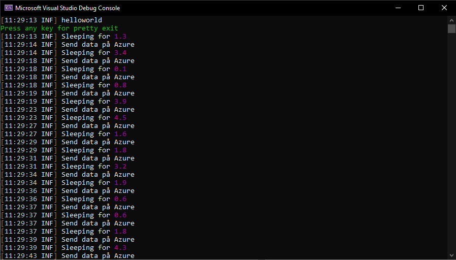

(Närvarande: Hampus, Andreas)

## Logga information i en applikation

Både när man utvecklar mjukvara, men även när den körs skarpt, så är de flesta (om inte alla) delar av organisationen behjälpta av data och statistik från applikation av flera anledningar. Det kan handla om allt från prestanda och livslängd till rena felhanteringar och bugg-sökande. 

Men hur gör man egentligen för att logga denna typ av information i sin applikation? Och vad är ett bra sätt att göra det på?

Till att börja med så behövs något som faktiskt loggar meddelanden och data på något vis. Det finns flera system som kan klara av detta på olika sätt men en devis att hålla i åtanke är att man faktiskt bör använda någon av dem. Inte bara för att man inte behöver uppfinna hjulet på nytt, utan även för att undslippa risken för att man gör något fel eller inte loggar allt man vill logga om man skulle bygga ett eget loggingsystem. Loggar är ofta väldigt viktiga och därför är det bättre att köra på ett tried and true system än att riskera att man gör något tokigt. I vårt fall har vi använt oss av Serilog som har en hel massa olika NuGet packet för att logga på olika sätt. Man kan såklart även använda sig av Microsofts egna logger extension som även den finns som NuGet.


#### Övning 1: Logga till konsolen i din applikation

För att testa på och öva på hur man brukar en log så har vi använt oss av ett kod-snippet vi fick av vår lärare:

```c#
static void Main(string[] args)
{
    var rand = new Random();
    bool runApp = true;
    Console.WriteLine("Press any key for pretty exit");
    while(runApp){
        int randomSleep = rand.Next(1, 50);
        Thread.Sleep(randomSleep*100);
        if(Console.KeyAvailable){
            Console.ReadKey(true);
            runApp = false;
        }
    }
}

static double SleepTimeToSec(int sleeptime){
    double realtime = (double)sleeptime / 10;
    return realtime;
}
```

Det koden gör är att helt enkelt att "söva" tråden i olika randomiserade intervall. Utifrån detta så använde vi oss av Serilog för att logga till konsolen och i slutändan såg vår kod ut såhär:

```C#
 static void Main(string[] args)
        {
            var log = new LoggerConfiguration()
             .WriteTo.Console()
             .CreateLogger();

            log.Information("helloworld");
            var rand = new Random();
            bool runApp = true;
            Console.WriteLine("Press any key for pretty exit");
            while (runApp)
            {
                int randomSleep = rand.Next(1, 50);
                log.Information($"Sleeping for {SleepTimeToSec(randomSleep)}");
                Thread.Sleep(randomSleep * 100);
                log.Information("Send data på Azure");
                if (Console.KeyAvailable)
                {
                    Console.ReadKey(true);
                    runApp = false;
                }
            }
```

Det som nu händer är helt enkelt att Seriloggern vi skapade loggar meddelanden till konsolen vid givna ögonblick där vi helt enkelt säger åt den att göra så. Konsolfönstret ser då ut ungefär såhär:

